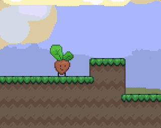

The Teeniest Seed is a puzzle-platformer storybook about a little seed who needed to find a patch of soil that's just right!

# [🌱 Play it here! (Web, HTML5) 🌱 ](https://jezzamon.itch.io/the-teeniest-seed)

## Controls:

- Arrow Keys: Move the seed
- Up Arrow: Jump
- Down Arrow: Plant yourself
- Space: Select in menus
- R: Reset level
- M: Mute music, press again to mute all sounds

## About

I took this Ludum Dare a little more relaxed than previous ones, which was nice! This was originally going to be a compo game, but at the deadline and decided I wanted to polish it a little more, so I entered the jam instead. On the third day, my wife jumped in and helped create the background art.

I enjoyed making it, and I'll definitely be releasing a post-compo one with more levels, so stay tuned for that. Let me know if you have any ideas you'd like to see in the game :)